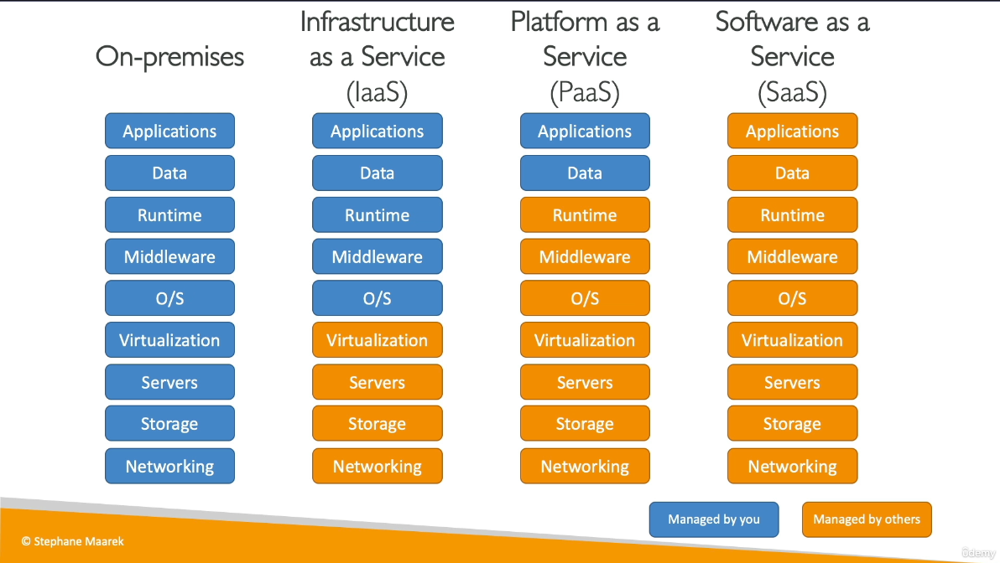

# Types of Cloud Computing

## Overview

## Infrastructure as a Service (IaaS)

1. Provide building blocks for cloud IT.
2. Provides networking, computers, data storage space.
3. Highest level as flexibility.
4. Easy parallel with traditional on-premises IT.
5. AWS: Amazon EC 2

## Platform as a Service (PaaS)

1. Removes the need for your organization to manage the underlying infrastructre.
2. Focus on deployment and management of your applications.
3. AWS: Elastic Beanstalk

## Software as a service (SaaS)

1. Complete product that is run and managed by the servie provider.
2. AWS: Rekognition for Machine Learning
